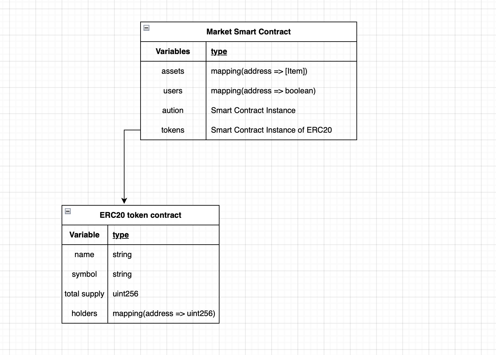
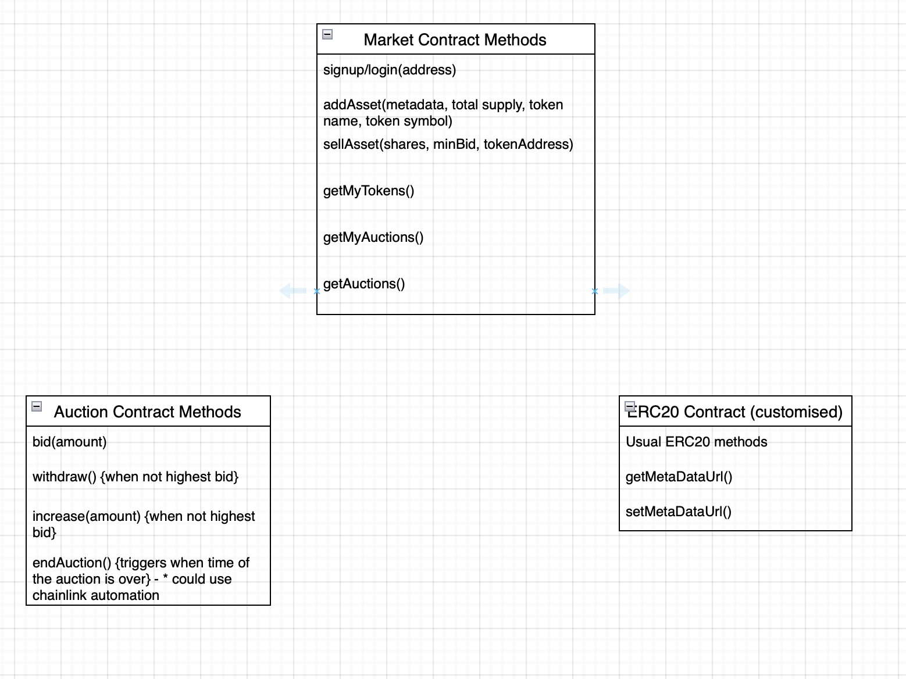
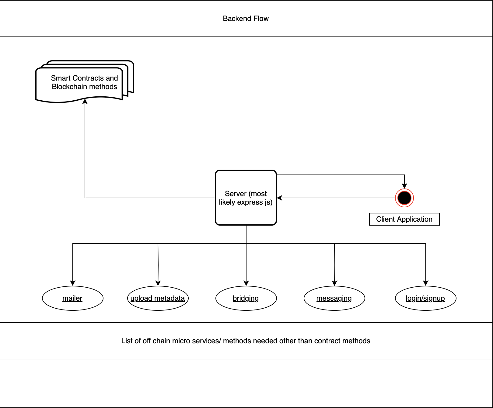

# Sytem design for ETH Online Project

## Smart Contract Part

### First Iteration

State variables based ER Diagram

### Second Iteration

First image displays the ER Diagram based on state variables and the second one displays the methods of each contract.

## Backend Structure/ Design

Basic System Design for the Project diagram
ß

## Flow

Visit-> connect wallet-> view listings --> auction open for X hours, Y/Z tokens --> users bid for Y --> highest bid wins Y
Visit-> connect wallet-> view listings --> auction open for X hours, Y/Z tokens are open --> users can bid for 10% of Y tokens max--> ownership allocated descending order of bids
Visit-> connect wallet-> view listings --> auction open for X hours ---> user submits request to buy 1 to Y/Z tokens 
